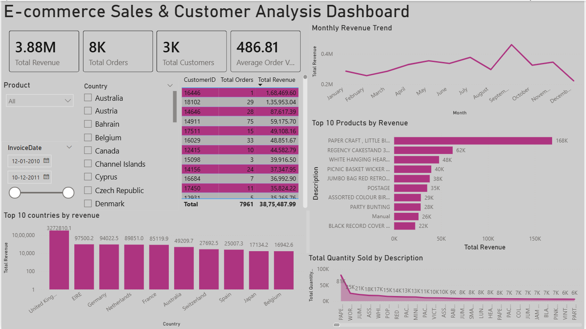

# E-commerce Sales Analysis Using SQL Server and Power BI

## Project Overview
This is an end-to-end data analysis project using SQL Server and Power BI. The project focuses on cleaning online retail transaction data, creating analysis-ready SQL views, and building an interactive Power BI dashboard to analyze revenue, orders, customers, products, and country-wise sales performance.

## Dashboard Preview

## Tools Used
- SQL Server
- SQL Server Management Studio
- Power BI
- DAX
- Excel/CSV Dataset
- GitHub

## Dataset
Dataset: Online Retail Dataset  
Source: UCI Machine Learning Repository  
Link: https://archive.ics.uci.edu/dataset/352/online+retail

The raw dataset is not uploaded because of file size and dataset ownership.

## Business Questions
- What is the total revenue?
- How many orders and customers were recorded?
- Which products generated the highest revenue?
- Which countries contributed the most revenue?
- How does revenue change monthly?
- Who are the high-value customers?

## Project Workflow
1. Imported raw CSV data into SQL Server.
2. Created a staging table for safe data loading.
3. Converted raw text fields into correct data types.
4. Removed invalid transactions.
5. Created a clean SQL analysis view.
6. Performed SQL-based business analysis.
7. Connected cleaned SQL data to Power BI.
8. Created DAX measures.
9. Built an interactive sales dashboard.

## Key Metrics

| Metric | Result |
|---|---:|
| Total Revenue | 8.91M |
| Total Orders | 19K |
| Total Customers | 4K |
| Average Order Value | 480.87 |
| Top Revenue Country | United Kingdom |
| Top Product | PAPER CRAFT, LITTLE BIRDIE |

## Dashboard Features
- KPI cards for revenue, orders, customers, and average order value
- Monthly revenue trend
- Top 10 products by revenue
- Top countries by revenue
- Customer-level revenue table
- Product, country, and date slicers
- Quantity sold by product visual

## Key Insights
- United Kingdom generated the highest revenue.
- A small number of products contributed a large share of revenue.
- Monthly revenue showed clear variation across the year.
- Customer-level analysis helped identify high-value customers.
- Interactive slicers allow analysis by product, country, and date range.

## Files Included
- `sql/Ecommerce_SQL_Analysis.sql` - SQL cleaning and analysis queries
- `powerbi/Ecommerce_Sales_Dashboard.pbix` - Power BI dashboard file
- `powerbi/DAX_MEASURES.md` - DAX measures used in the dashboard
- `screenshots/dashboard_overview.png` - dashboard screenshot
- `DATASET.md` - dataset details
- `REQUIREMENTS.md` - tools required

## How To Run
1. Download the Online Retail dataset from the UCI link.
2. Open SQL Server Management Studio.
3. Create a database named `ecommerce_project`.
4. Run the SQL script from `sql/Ecommerce_SQL_Analysis.sql`.
5. Open the Power BI file from `powerbi/Ecommerce_Sales_Dashboard.pbix`.
6. Refresh the data source connection if required.
7. Use slicers to explore sales by product, country, and date.

## Skills Demonstrated
- SQL data cleaning
- SQL aggregation and analysis
- Data transformation
- Power BI dashboard design
- DAX measures
- Business intelligence reporting
- Data storytelling

